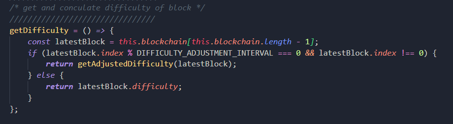

# Da-Wallet

 ## Run
    * cd /src
    * npm i
    * npm start

 ## Reference
 - Tham khảo nguồn : https://lhartikk.github.io/ để build blockchain backend

 ## Các chức năng đã hoàn thiện
 - Tạo ví: tạo ví bằng cách gen ra privateKey, người dùng phải giữ key này cho những lần đăng nhập vào ví
 - Gửi transaction: người dùng có thể gửi transaction tới 1 địa chỉ khác
 - Mine block: người dùng có thể mining block và nhận được 1 lượng coinBase = 0.05 (hard code)
 - Xem số dư
 - Xem các transaction trong transactionPool

 ## Các phần chưa hoàn thiện
 - Xem lịch sử giao dịch (có hàm nhưng chưa làm UI)
 - Chưa setUp cho hệ thống tự động gom transaction trong transactionPool vào block (hiện tại vẫn đang mine bằng tay)
 - Chưa set cho hệ thống chạy trên docker

 ## Các kĩ thuật đã sử dụng
 - Sử dụng thuật toán <storng> Proof of work </strong> 
 

 - Sử dụng <strong>Websocket</strong> để broadcast đến các client connect
 
 
